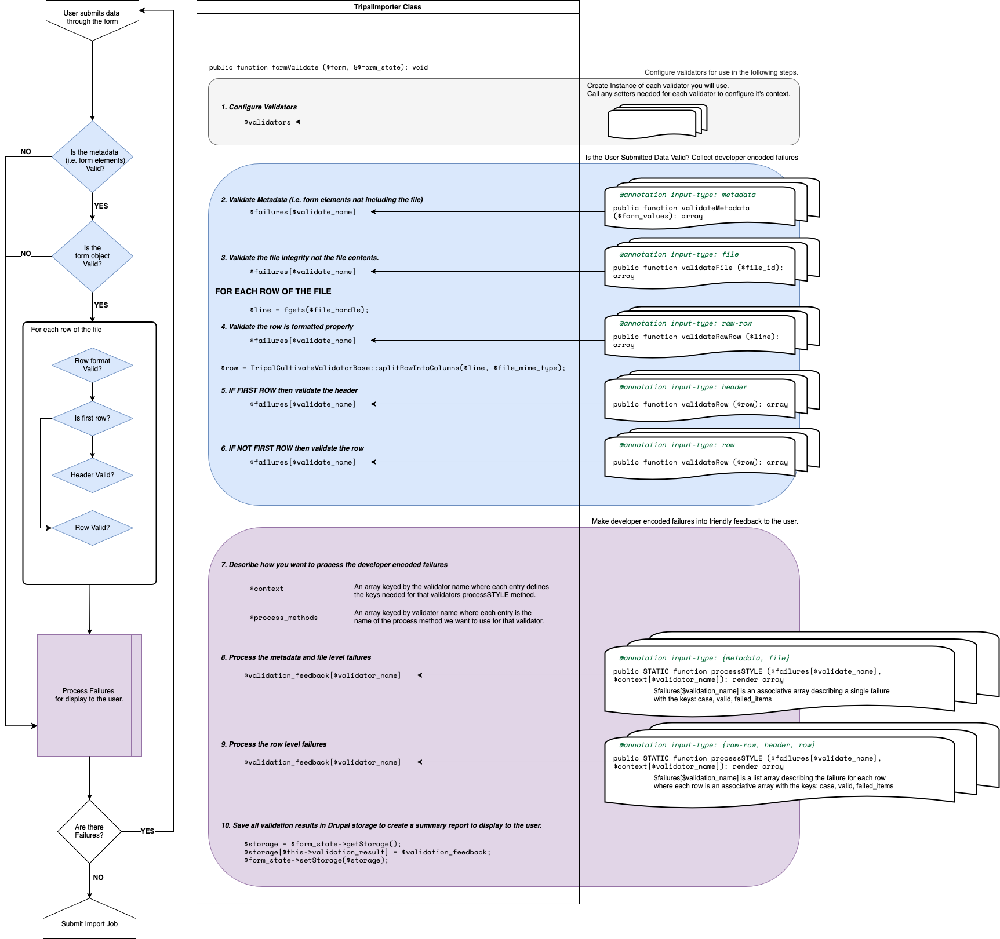

# TripalCultivate Validator Plugin API

This documentation assumes you have an understanding of Drupal Plugins and Tripal Importers. Additionally, you will likley want to import your data into the Chado database which is where Tripal stored biological data by default. Tripal will sometimes refer to TripalImporters that specifically import into chado as Chado Importers.

If not, here are some resources which may be helpful:

- [Tripal: What is a plugin?](https://tripaldoc.readthedocs.io/en/latest/dev_guide/module_dev/plugin_service.html#what-is-a-plugin)
- [Tripal: Creating a Chado Data Importer](https://tripaldoc.readthedocs.io/en/latest/dev_guide/biodata/importers.html)
- [Tripal: Biological Data Storage](https://tripaldoc.readthedocs.io/en/latest/dev_guide/biodata.html)

## What are Validators?

When importing data using TripalCultivate importers you will see detailed metadata and file validation feedback. As an example, the Tripal Cultivate: Phenotypic Trait Importer will show a validation window when you submit a file to be imported. This validation window is a result of a collection of validators used by this importer.

-- SCREENSHOT OF VALIDATION WINDOW --

Generally, each section of this validation window is populated by a single instance of a TripalCultivate Validator and the Tripal Importer compiles them into a window for display to the user.

## How are validators used by a Tripal Importer?

Tripal Importers use the Drupal Form API to collect metadata and a file from the user. When the user submits this form, the Tripal Importer API will call the importers `TripalImporter::formValidate()` method to validate the users input. This is where the TripalCultivate validators step in to provide modular validation. If the validators determine everything submitted was valid, then the importers `TripalImporter::formSubmit()` is called and a Tripal Job is submitted to import the data into Chado.

Now, lets focus on that validation process. The following diagram summarizes the tasks undertaken by the importers `TripalImporter::formValidate()` method.

On the far left of the diagram you will notice a decision flow chart showing the order that user submitted data is validated. The right side of the diagram indicates 10 tasks carried out by the importer `TripalImporter::formValidate()` (inside the "TripalImporter Class" container) and how those tasks interact with TripalCultivate validator instances (visualized as 3-document stacks on the far right side).

At a high level, the `TripalImporter::formValidate()` will

 - Configure the TripalCultivate Validators by using the plugin manager to create instances of each validator and then calling and `Validator::set*()` methods required by each validator. This is shown in grey in the diagram and is Task #1.
 - Use the validators to check the user submitted data. This is done by passing the user submitted data to the validator as a parameter to its `Validator::validate*()` method. The full method name is dependant on the input-type of data being validated. The `Validator::validate*()` method will then return a developer-focused report of any failures. This is shown in blue in the diagram and is Tasks #1-6.
 - Use the validators to process the developer-focused failure reports into user friendly feedback tailored to this particular importer. This is done by calling the static `Validator::process*()` method for each validator with both the developer-focused failures report and any additional importer-specific context. Each `Validator::process*()` method returns a Drupal render array which is ready to be displayed in the validation window. This is shown in purple in the diagram and is Tasks #7-9.
 - Finally the importer will determine if the validators returned any failures and if yes, the user friendly feedback will be added to the form and it will be rebuilt. This will show the user the feedback and allow them to make any fixes needed before submitting it again. If there are no failures then a Tripal Job is submitted to import the data into Chado.

While both the `Validator::validate*()` and `Validator::process*()` methods are part of a TripalCultivate validator, the first is a typical method with access to the configurations set by the importer and the second is a static method that only has access to the parameters you provide it. This separation ensures that no assumptions are made when processing the developer-focused failure report beyond those laid out in the context parameter. There may also be more then one `Validator::process*()` method for a single validator in order to provide a choice of summary report to the importer. Another thing to note is that the `Validator::process*()` method will only ever be called once per user submission since it compiles all the failures for that validator into a summary report for the user. The `Validator::validate*()` method may be called once per line of the file (e.g. validators with input type of `row` or `header`).
